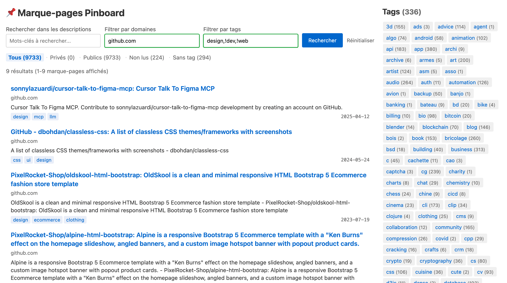
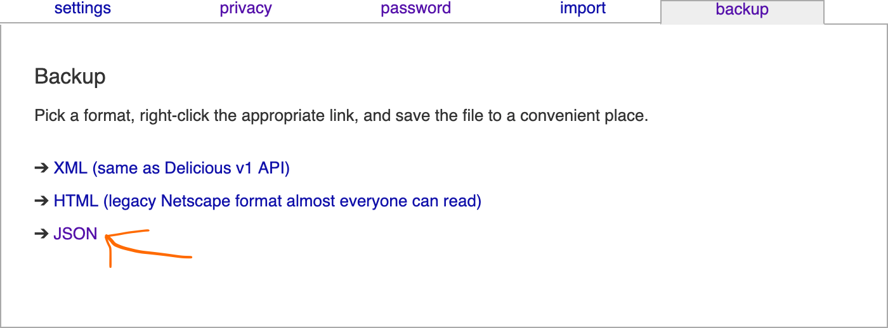

# 📌 Pinboard Backup Reviver

A **simple web GUI** for browsing your [Pinboard](https://pinboard.in/) bookmarks **locally**.

Live **demo** (using my bookmarks): https://pinboard-backup-reviver.apps.louis.ga/

## About

**Pinboard Backup Reviver** is a tool that allows you to view and navigate through your **locally** exported **Pinboard bookmarks**.

If you have a **JSON backup file** of your Pinboard bookmarks and want to access them easily without needing an internet connection or access to Pinboard, this tool is for you.



Made using [FastHTML](https://fastht.ml/).

## Features

- **Offline** browsing of your Pinboard bookmarks.
- Simple and intuitive **web interface** (quite similar to Pinboard's one).
- **Filter** by title, description, domains, tags.
- Ability to exclude tags or domains from the results.
- Option for including/excluding your private bookmarks (if you want to make Pinboard Backup Reviver accesible to others).
- Single file; easy to tweak.

## Usage

```bash
# Clone the repository
git clone https://github.com/louisgavalda/pinboard-backup-reviver.git pinboard-backup-reviver-git
cd pinboard-backup-reviver-git

# Run the application with uv; you simply need to specify the path to a JSON Pinboard backup
uv run main.py ~/sync/save/backups/PINBOARD_EXPORT_FILE.json
```

The application automatically starts a local web server.
Then open your browser at: http://localhost:5000

The application loads your JSON bookmarks file and can optionally include your private bookmarks (hidden by default).
See the example below for sample usage:
`pinboard-backup-reviver-git ~/pinboard-backup.json --include-private`

## Getting your Pinboard bookmarks

To retrieve your Pinboard bookmarks as a JSON file:

1. Log in to your [Pinboard account](https://pinboard.in).
2. Go to the settings page by clicking on the "settings" link in the top-right corner.
3. Click on the "backup" tab.
4. Under "Export", click on "JSON" to download all your bookmarks as a JSON file.
5. Save this file to your computer - this is the file you'll use with Pinboard Backup Reviver.



This backup contains all your bookmarks including titles, URLs, descriptions, tags, and timestamps.

## Acknowledgments

- [Pinboard](https://pinboard.in) for their excellent bookmarking service.
- [FastHTML](https://fastht.ml/) contributors.
- [HTMX](https://htmx.org/) creator and contributors.

## License

This project is licensed under the MIT License; see the [LICENSE](LICENSE) file.
